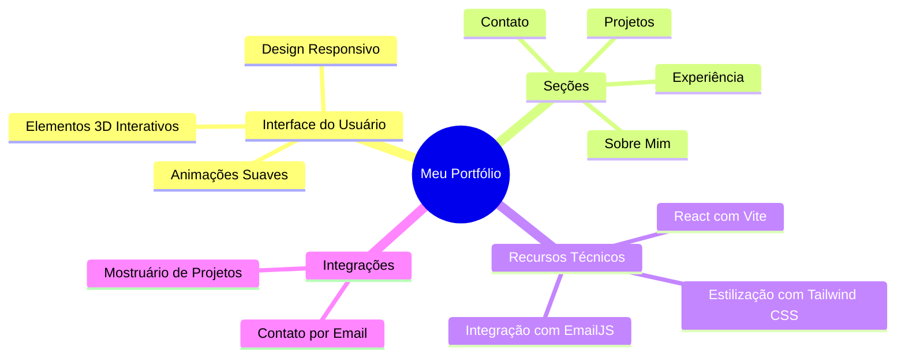

<div align="center">


[](LICENSE)
[](https://meuportfolio.vercel.app)
[](https://reactjs.org)

<p align="center">Um portfólio moderno e responsivo mostrando experiência profissional, projetos e habilidades. Construído com React, Vite e Tailwind CSS, apresentando animações suaves e elementos interativos.</p>

</div>

## ✨ Funcionalidades

<div align="center">



</div>

## 🚀 Demonstração

Você pode acessar a demonstração do portfólio [aqui](https://rochinh-a.github.io/rocha-portfolio/).

## 🖼️ Capturas de Tela

<!-- Adicione capturas de tela do seu projeto aqui -->

## 🛠️ Instalação

Siga os passos abaixo para rodar o projeto localmente:

1. Clone o repositório:
   ```sh
   git clone https://github.com/rochinh-a/rocha-portfolio.git
   ```
2. Navegue até o diretório do projeto:
   ```sh
   cd rocha-portfolio
   ```
3. Instale as dependências:
   ```sh
   npm install
   ```
4. Inicie o servidor de desenvolvimento:
   ```sh
   npm run dev
   ```

## 🧰 Tecnologias

- **React** - Biblioteca JavaScript para construção de interfaces de usuário
- **Vite** - Ferramenta de build rápida para projetos web modernos
- **Tailwind CSS** - Framework de CSS utilitário para estilização rápida e eficiente
- **EmailJS** - Serviço para envio de emails diretamente do JavaScript

## 📄 Licença

Este projeto está licenciado sob a licença MIT. Veja o arquivo [LICENSE](LICENSE) para mais detalhes.
